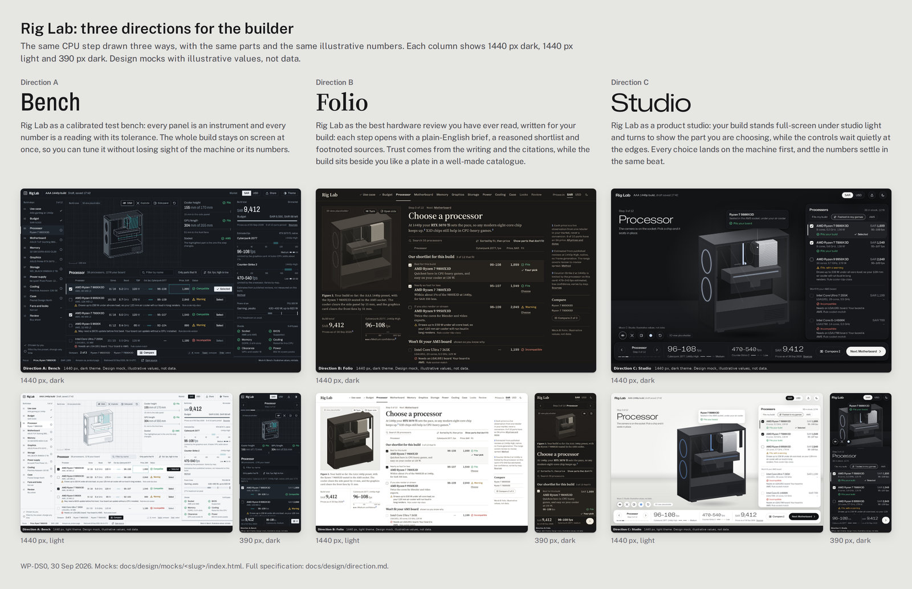
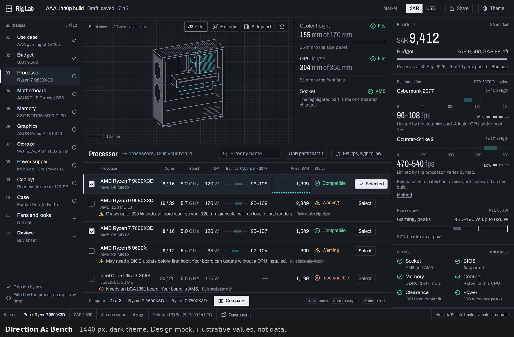
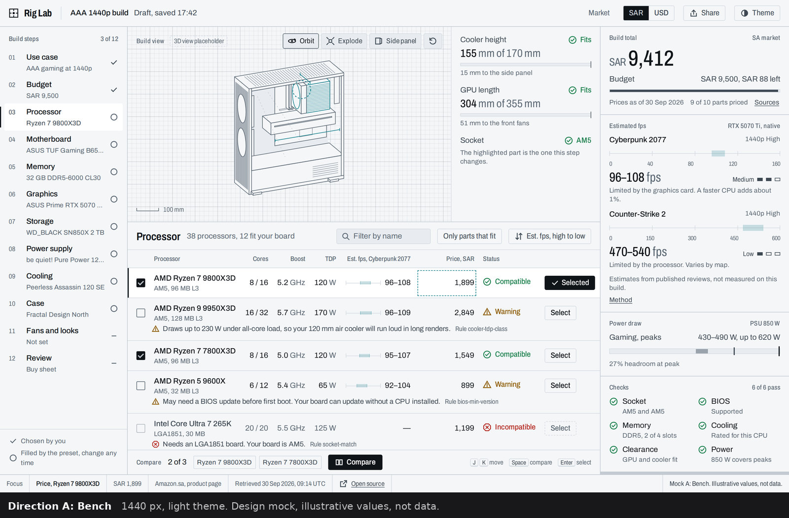
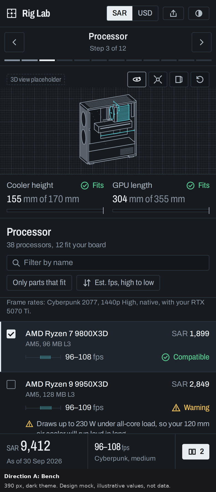
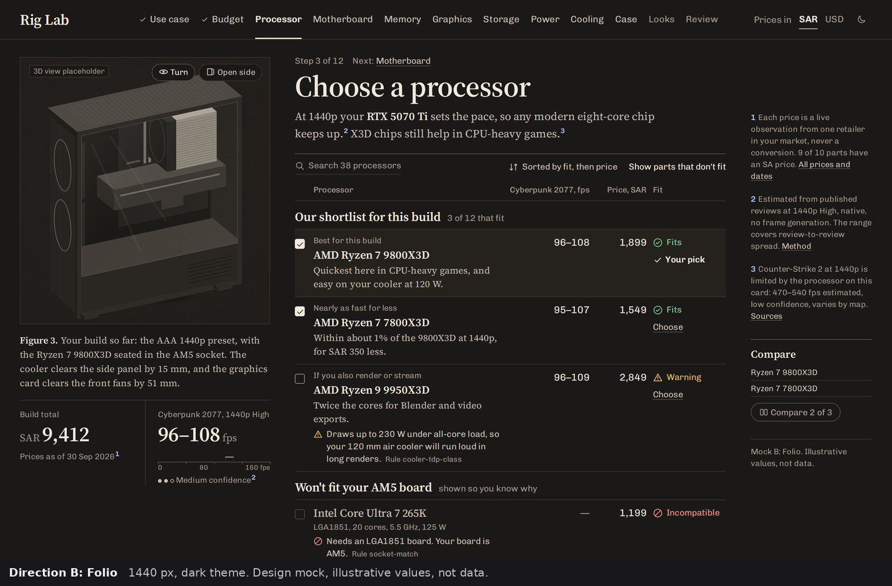
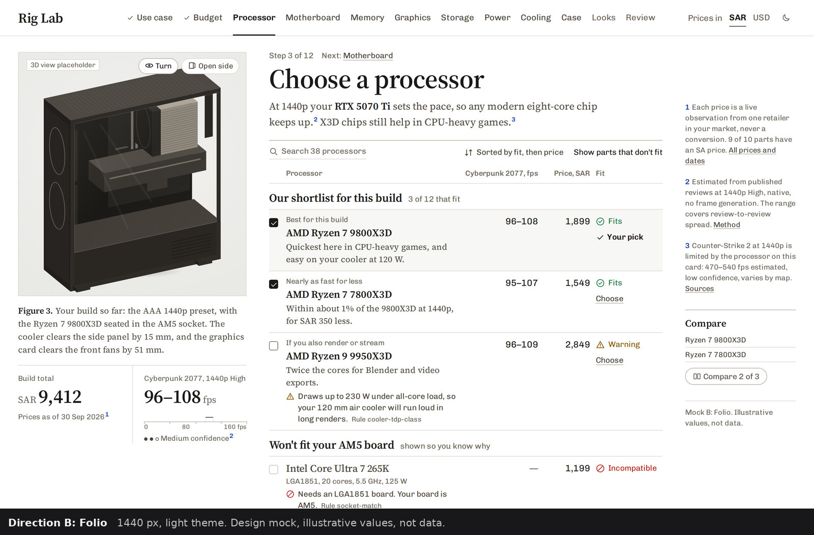
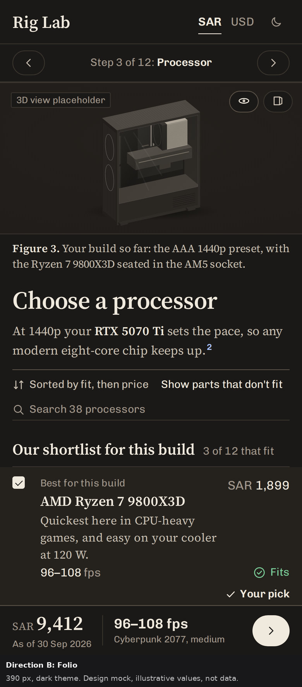
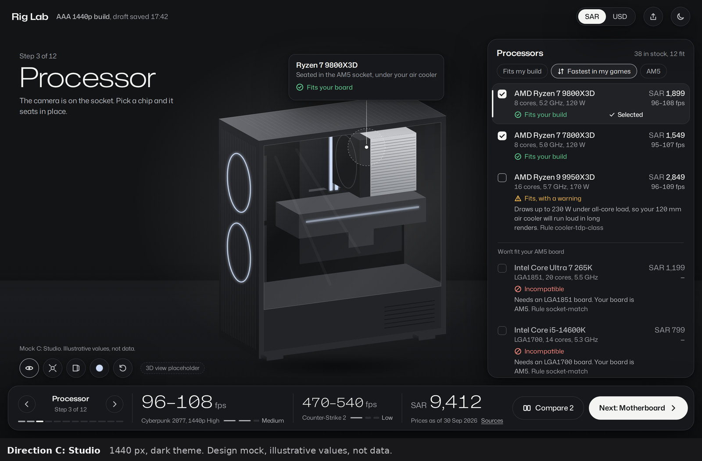
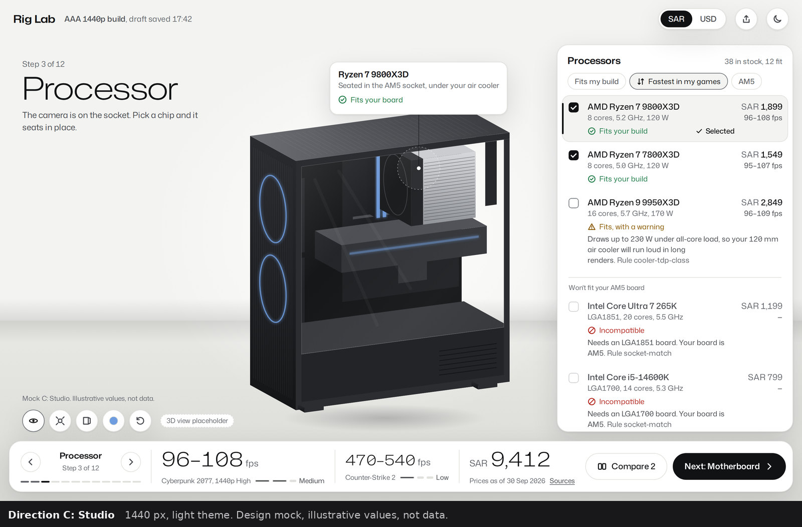
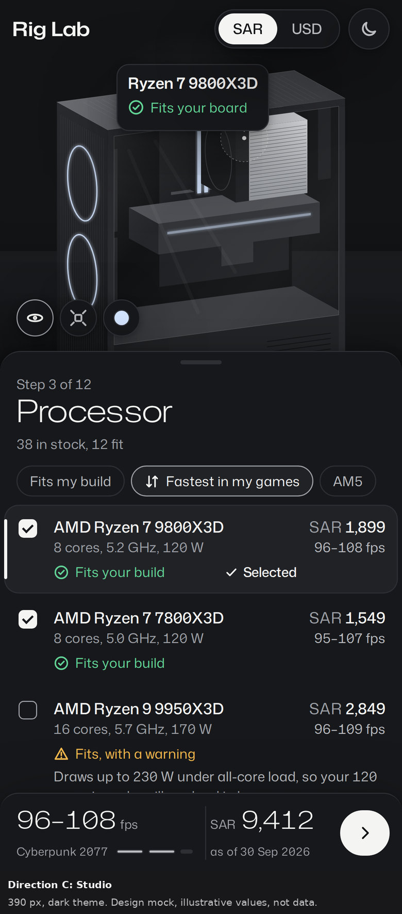

# Design direction (WP-DS0)

Owner: design-lead · Date: 2026-09-30 · Status: ready for review

**Decision needed:** Hazem picks one of A, B or C (Owner's rules for Phase 0, rule 2). The Director
reviews first. The design lead's recommendation is at the end, and it is advice only.



One-screen summaries, one per direction:
[A Bench](board/a-bench.jpg) · [B Folio](board/b-folio.jpg) · [C Studio](board/c-studio.jpg).
Each shows the name, a two-sentence thesis, and the 1440 dark, 1440 light and 390 dark mocks.
The board's source is [`board/index.html`](board/index.html).

| | Direction | Thesis (two sentences) | Mock |
|---|---|---|---|
| A | **Bench** | Rig Lab as a calibrated test bench: every panel is an instrument and every number is a reading with its tolerance. The whole build stays on screen at once, so you can tune it without losing sight of the machine or its numbers. | [`mocks/bench/`](mocks/bench/index.html) |
| B | **Folio** | Rig Lab as the best hardware review you have ever read, written for your build: each step opens with a plain-English brief, a reasoned shortlist and footnoted sources. Trust comes from the writing and the citations, while the build sits beside you like a plate in a well-made catalogue. | [`mocks/folio/`](mocks/folio/index.html) |
| C | **Studio** | Rig Lab as a product studio: your build stands full-screen under studio light and turns to show the part you are choosing, while the controls wait quietly at the edges. Every choice lands on the machine first, and the numbers settle in the same beat. | [`mocks/studio/`](mocks/studio/index.html) |

All three mocks show the same CPU step:
- the same build (the AAA 1440p preset on an AM5 board with an RTX 5070 Ti);
- the same real CPUs, in ok, warn and block states with reasons;
- the step nav, a 3D view placeholder, a compare affordance, the live total with its SAR/USD
  toggle, and a live FPS preview.

**All values are illustrative, not data.** Each mock says so on screen.

Related documents:
- [reference study](reference-study.md), with screenshots in [references/](references/README.md);
- [motion specification](motion.md), with frame-time measurements;
- [3D asset survey](3d-asset-survey.md);
- [tools](tools/): the contrast check, motion check, screenshot and board scripts, and the
  placeholder drawing generator.

---

## 1. What all three share

The directions differ in structure, type, colour and motion. These rules do not change. They come
from the brief (BUILD_PROMPT §0, §4, §5.3, §6) and from the reference study.

### 1.1 Numbers are the product

- **Tabular lining figures** in every numeric cell, readout and total
  (`font-variant-numeric: tabular-nums lining-nums`). Prose keeps the font's default figures.
- **Check every typeface's tabular set.** Some fonts make punctuation tabular too, which puts gaps
  into "1 , 899" and into running text. Checked with fontTools:
  - **punctuation too:** Encode Sans, Instrument Sans, Newsreader, Onest, Public Sans and
    Schibsted Grotesk. Schibsted's comma grows from 543 to 1300 units.
  - **digits only:** Archivo, Mona Sans and Chivo. Source Serif 4's digits are already tabular by
    default.

  Folio switched from Schibsted Grotesk to Chivo because of this.
- **Units** follow the number after a no-break space ("120 W", "5.2 GHz") and never wrap away
  from it. In readouts the unit is set smaller, in the secondary ink.
- **Ranges** use an en dash with no spaces, and the unit appears once: "96–108 fps", never
  "96 fps – 108 fps".
- **Estimates are always ranges with a confidence level** (CLAUDE.md rule 2):
  - The level is a word (High, Medium, Low) plus a three-step mark, so it never relies on colour.
  - It sits next to the test conditions ("Cyberpunk 2077, 1440p High, native").
  - Frame generation is never mixed in (§4.7 of the plan). "Native" is stated, and upscaled or
    frame-generated numbers get their own labelled line.
  - The engine team defines what each level means. The UI links to the method.
- **Money.**
  - Show the ISO code before the amount: "SAR 9,412", "USD 2,469". In tables the code sits in the
    column header, and the cells show amounts only.
  - Show prices exactly as observed.
  - The toggle **switches market**, not currency. SA prices are observed in SAR, US prices in USD,
    and nothing is ever converted (plan §4.6).
- **Dates** are "30 Sep 2026" in the UI. Provenance times are in UTC and say "UTC".
- **Missing data is stated, not hidden.**
  - A missing price reads "No SA price found", backed by the gap record (plan §4.6), and the
    total counts priced parts ("9 of 10 parts priced").
  - An FPS figure for an incompatible part is "—", with the accessible name "Not estimated".

### 1.2 Every number carries its source, without clutter

The same idea in each direction: **one as-of stamp per panel, and the full source one step away
from the number itself** (Our World in Data's source line, Apple's footnote markers).

| | Where the as-of date lives | How one number's source appears |
|---|---|---|
| A Bench | In each readout panel ("Prices as of 30 Sep 2026, 9 of 10 parts priced, Sources") | Focus or hover any number; the **status line** at the bottom reads out value, retailer, page, retrieved time (UTC) and "Open source" |
| B Folio | Under the total ("Prices as of 30 Sep 2026¹") | **Numbered notes** in the margin (inline at 768 and 390) explain the source and method; each price opens a small note with retailer, date and link |
| C Studio | In the dock beside the total ("Prices as of 30 Sep 2026, Sources") | A **popover** from the number (specified, not built in the mock) with retailer, date and link |

### 1.3 Compatibility: ok, warn, block

- Every state has **four carriers**: an icon with its own silhouette, a text label, the state
  colour, and a one-sentence reason with its rule id ("Needs an LGA1851 board. Your board is
  AM5. Rule socket-match"). Colour is never the only signal (WCAG 1.4.1).
- Icon silhouettes:
  - ok is a circle with a check;
  - warn is a triangle;
  - block is an octagon (Bench) or a slashed circle (Folio, Studio).
- **Blocked parts are shown, not hidden,** so buyers learn why. They cannot be selected, show no
  FPS estimate, and keep the reason visible, never only in a tooltip.
- Reason sentences are in the secondary ink, not the state colour, so a list full of warnings
  stays calm. The state colour is used only on the icon and the label.
- The build-level status is a sentence ("6 of 6 pass" or "5 of 6 pass, 1 warning"), after
  PCPartPicker's compatibility bar.

### 1.4 Accessibility floor

- **WCAG 2.1 AA, measured on the tokens the mocks actually use.** Every text pair is at least
  4.5:1, and every non-text UI pair (focus ring, checkbox border, state icons, data traces) is at
  least 3:1, in dark and light. See [`tools/contrast.mjs`](tools/contrast.mjs); the tables are in
  each direction's section.
  - The check caught one real failure: Studio's tertiary ink over the brightest point of the
    stage's key light was 4.24:1. It was fixed by lightening the token to reach 5.11:1, rather
    than by relying on placement.
- **Focus** is always visible: a 2 px ring with offset, in `--focus`.
- **Keyboard.** Every row and control is a button or checkbox. Bench shows its keys ("J K move,
  Space compare, Enter select").
- **Reduced motion** removes all motion; measured, 0 animations run (see the
  [motion spec](motion.md)).
- **Number swaps** announce the final value once, via `aria-label` on the value. The old value is
  `aria-hidden`.
- **Text size.** The smallest running text is 12 px, used for labels and captions. Only three
  things go smaller: Bench's scale ticks (their values are also given as text), Bench's key caps,
  and Folio's note markers, all 11 px.

### 1.5 The 3D view

- **Desktop:** always visible, in a **fixed-size slot**, so the page never shifts when the scene
  streams in. build-lead's scaffold asserts CLS = 0 on a reserved box.
- **Phone:** the 3D can't always be visible, so each direction keeps the live numbers in a
  **docked bar** and says how to get back to the build (each section below explains how).
- In the mocks the 3D is a labelled **"3D view placeholder"**: one generic mid-tower drawn at
  real millimetre sizes by [`tools/iso-case.mjs`](tools/iso-case.mjs). Each direction styles the
  same geometry its own way, which previews its 3D art direction.

### 1.6 Fonts

- All typefaces are **SIL Open Font License 1.1**. Each licence was read from its `OFL.txt` in
  github.com/google/fonts. None needs Hazem's approval, because none costs money.
- **At most 2 families and 4 weights.**
- **Byte cost is measured, not estimated.** Each set was instanced to the axis ranges we use,
  subset to Latin plus ≤ ≥ ≈ −, and compressed to WOFF2 with fontTools 4.66.1.
- **Mocks vs production.** The mocks load Google Fonts with wide axis ranges. Production
  self-hosts the measured subsets (WP-DS1).

---

## 2. Direction A: Bench

> Rig Lab as a calibrated test bench: every panel is an instrument and every number is a reading
> with its tolerance. The whole build stays on screen at once, so you can tune it without losing
> sight of the machine or its numbers.

| 1440, dark | 1440, light | 390, dark |
|---|---|---|
|  |  |  |

More views: [768 dark](mocks/bench/768-dark.jpg), [390 light](mocks/bench/390-light.jpg),
[390 full page](mocks/bench/390-dark-full.jpg).

### Palette

Graphite, like anodised test gear. **Colour means only two things: a state (ok, warn, block) or
a measurement (the cyan trace).** Interactive emphasis uses luminance instead: the pressed
segment, the white primary button, the 2 px bar on the selected row. There is no brand hue to
compete with the states.

| Token | Dark | Light | Use |
|---|---|---|---|
| `--bench` | `#0e1114` | `#c3cad1` | Seams between panels, the app ground |
| `--panel` | `#171b20` | `#f4f6f8` | Panel surfaces |
| `--panel-raised` | `#1f252c` | `#ffffff` | Selected row, hover |
| `--panel-sunk` | `#13171b` | `#e8ecf0` | Inputs, meters |
| `--line` | `#2c343d` | `#d6dce2` | Dividers inside panels |
| `--ink` / `--ink-2` / `--ink-3` | `#e8edf1` / `#aeb8c2` / `#85919d` | `#0f1419` / `#3d4853` / `#5a6672` | Text: primary, secondary, labels and units |
| `--trace` | `#56d4dd` | `#0a7a87` | Measurements only: range bands, meters, dimension lines, the part this step changes |
| `--ok` / `--warn` / `--block` | `#56c990` / `#ebbe55` / `#f2837b` | `#1b7f4c` / `#8c5a00` / `#b3261e` | States |
| `--focus` | `#ffffff` | `#0f1419` | Focus ring |

**Contrast, measured on the mock's tokens** (WCAG 2.1; text 4.5:1, non-text UI 3:1; generated by
[`tools/contrast.mjs`](tools/contrast.mjs), all pairs pass):

| Foreground | Background | Use | Kind | Dark | Light |
|---|---|---|---|---|---|
| `--ink` | `--panel` | primary text | text (4.5:1) | 14.67:1 pass | 17.09:1 pass |
| `--ink-2` | `--panel` | secondary text | text (4.5:1) | 8.60:1 pass | 8.61:1 pass |
| `--ink-3` | `--panel` | labels, units, meta | text (4.5:1) | 5.38:1 pass | 5.42:1 pass |
| `--ink` | `--panel-raised` | text on selected row | text (4.5:1) | 13.11:1 pass | 18.51:1 pass |
| `--ink-2` | `--panel-raised` | secondary on selected row | text (4.5:1) | 7.68:1 pass | 9.33:1 pass |
| `--ink-3` | `--panel-raised` | meta on selected row | text (4.5:1) | 4.81:1 pass | 5.87:1 pass |
| `--ink-3` | `--panel-sunk` | placeholder in inputs | text (4.5:1) | 5.60:1 pass | 4.94:1 pass |
| `--ok` | `--panel` | Compatible label | text (4.5:1) | 8.36:1 pass | 4.63:1 pass |
| `--warn` | `--panel` | Warning label | text (4.5:1) | 9.91:1 pass | 5.42:1 pass |
| `--block` | `--panel` | Incompatible label | text (4.5:1) | 6.84:1 pass | 6.03:1 pass |
| `--ok` | `--panel-raised` | Compatible on selected row | text (4.5:1) | 7.47:1 pass | 5.02:1 pass |
| `--btn-ink` | `--btn-bg` | primary button | text (4.5:1) | 16.06:1 pass | 18.51:1 pass |
| `--bench` | `--ink` | pressed segment (SAR/USD) | text (4.5:1) | 16.06:1 pass | 11.19:1 pass |
| `--trace` | `--panel` | measurement trace, range edges | ui (3:1) | 9.77:1 pass | 4.67:1 pass |
| `--ink-3` | `--panel` | checkbox border | ui (3:1) | 5.38:1 pass | 5.42:1 pass |
| `--focus` | `--panel` | focus ring | ui (3:1) | 17.30:1 pass | 17.09:1 pass |
| `--ink` | `--panel` | selected-row bar | ui (3:1) | 14.67:1 pass | 17.09:1 pass |

### Typeface

**Archivo** by Omnibus-Type (SIL OFL 1.1; "Copyright 2020 The Archivo Project Authors").
- One variable file with width and weight axes. We use width 75–100% and weight 400–600.
- The width axis does the instrument work: condensed labels and readouts, normal-width text.
- Features: `tnum` (digits only), `zero` (slashed zero in readouts), `case`.
- **Byte cost: 40.1 KB** for one Latin-subset WOFF2 covering width 75–100 and weight 400–600.
  The wordmark in the mock uses 700; in production the wordmark is an SVG.

| Role | Size / line | Weight | Width | Notes |
|---|---|---|---|---|
| Total readout | 40 / 44 | 500 | 75% | Currency code 20 px in `--ink-3` |
| Value readout (FPS, clearances) | 24 / 28 and 20 / 24 | 500 | 75–82% | Unit smaller, in `--ink-3` |
| Step title | 20 / 24 | 600 | 82% | "Processor" |
| Body and table | 14 / 20 | 400 and 500 | 100% | Part names 500 |
| Reason line | 13 / 18 | 400 | 100% | Rule id 12 px, 82% |
| Label | 12 / 16 | 500 | 82% | Sentence case, +0.02em tracking; never all caps |
| Scale ticks | 11 / 14 | 400 | 82% | Decorative; the value is repeated as text |

### Layout

**1440: a fixed workspace with no page scroll.** Panels scroll on their own.

```
┌ bar 48 ── Rig Lab │ AAA 1440p build, draft saved ─────────── Market [SAR|USD] Share Theme ┐
├ rail 232 ─┬ centre ─────────────────────────────────────────┬ readout 344 ────────────────┤
│ 01 Use    │ Build view (3D) 356 tall          │ Clearance    │ Build total      SAR 9,412  │
│ 02 Budget │ drawing on a true-scale grid,     │ cooler 155/170│ budget bar, as of, sources │
│>03 CPU    │ 100 mm scale bar, tools           │ GPU 304/355  │ Estimated fps: 2 games,     │
│ 04 Board  │                                   │ socket AM5   │ range bars, confidence      │
│ ...       ├───────────────────────────────────┴──────────────┤ Power draw vs PSU           │
│ 12 Review │ Processor  38, 12 fit  [filter] [fits] [sort]    │ Checks 6 of 6               │
│ legend    │ table, sticky header, reason lines               │                             │
│           │ compare bar           J K move, Space, Enter      │                             │
├───────────┴──────────────────────────────────────────────────┴─────────────────────────────┤
└ status 32: Focus │ Price, Ryzen 7 9800X3D │ SAR 1,899 │ Amazon.sa │ Retrieved … UTC │ Open source ┘
```

- **768.** The rail becomes a scrolling step strip. The build view spans the full width (drawing
  plus clearance callouts, 320 px). The table drops the Boost and TDP columns, and the readout
  panels move below it in two columns. A **docked readout bar** keeps the total with its as-of
  date, both FPS ranges and Compare in view.
- **390.** A stepper shows prev and next, "Processor, Step 3 of 12", and a 12-segment progress
  bar. The build view shrinks to a 156 px strip with the two clearance readings. Table rows stack:
  name and price, then FPS range and status, then the reason. One line states which game and
  preset the FPS column uses. The docked bar shows the total with as-of, the Cyberpunk range with
  its confidence, and a Compare count.
- **3D on phone.** The strip scrolls away with the page while the docked bar keeps the numbers.
  Tapping the strip opens the 3D view full screen (specified, not built).

### Key components

- **Part row.** 40 px, plus a 22 px reason line when needed.
  - Columns: compare checkbox; name with a socket and cache sub-line; cores and threads; boost;
    TDP; estimated FPS as a mini range bar with numbers; price; status; action.
  - Selected: a raised surface and a 2 px ink bar.
  - Blocked: the name in `--ink-2`, a dashed disabled "Select", "—" for FPS, and the reason visible.
- **Compatibility badge.** Circle-check, triangle or octagon, with "Compatible", "Warning" or
  "Incompatible" in the state colour. The reason and rule id sit on the line below.
- **Price with as-of and source.**
  - The column header carries the currency ("Price, SAR").
  - Each price is focusable and reads out its provenance in the status line.
  - The panel stamp gives "Prices as of 30 Sep 2026, 9 of 10 parts priced, Sources".
- **FPS range with confidence.**
  - A 0–160 fps scale with ticks, and a band from the low to the high estimate with trace-coloured
    end caps.
  - The reading "96–108 fps", with confidence as a three-segment meter plus a word.
  - A limiter line in plain English ("Limited by the graphics card. A faster CPU adds about 1%.").
  - The header states "RTX 5070 Ti, native".
- **Step nav.** Twelve numbered rows; the numbers are the real sequence. Each shows the chosen
  part or "Not set". Glyphs: a check means chosen by you, a ring means filled by the preset, a
  dash means not set.
- **Live total.** The condensed readout plus a budget bar ("SAR 88 left").
- **Compare.** A checkbox per row, up to 3. The compare bar carries chips and a "Compare" button.

### Motion, iconography, 3D

- **Motion.** Mechanical and exact: 160–180 ms, `cubic-bezier(.2, 0, 0, 1)`, no overshoot.
  Numbers swap like a counter ticking. See [motion.md](motion.md#direction-a-bench-mechanical-exact-fast).
- **Iconography.** A 16 px grid, 1.5 px stroke, square caps and mitred joins, so icons look
  drawn, not cute. Every icon is paired with a label or an `aria-label`. No emoji.
- **3D art direction** (from the [survey](3d-asset-survey.md#lighting-and-material-mood-per-direction)):
  - flat measurement lighting;
  - an optional orthographic camera;
  - the part this step changes outlined in the trace colour, with everything else at 30%
    ("x-ray");
  - clearance lines drawn in 3D.

  It is the cheapest look for the Arc iGPU, and it makes representative models look intentional.

### Risks

- **Density can intimidate first-time buyers.** The use-case step and plain-English limiter lines
  must carry newcomers, or the direction fails the "walks in knowing nothing" goal.
- **The fixed workspace needs about 1280 × 800.** Between 1024 and 1279 px the readout column must
  narrow or collapse into the docked bar.
- **The 3D view is the smallest of the three,** which is weak for the looks and RGB goals of
  Phase 3.
- **It can tip into dev-tool coldness.** The warmth has to come from the words.
- Condensed 12 px labels need a check on real devices.

---

## 3. Direction B: Folio

> Rig Lab as the best hardware review you have ever read, written for your build: each step opens
> with a plain-English brief, a reasoned shortlist and footnoted sources. Trust comes from the
> writing and the citations, while the build sits beside you like a plate in a well-made catalogue.

| 1440, dark | 1440, light | 390, dark |
|---|---|---|
|  |  |  |

More views: [768 dark](mocks/folio/768-dark.jpg), [390 light](mocks/folio/390-light.jpg),
[390 full page](mocks/folio/390-dark-full.jpg).

### Palette

**Dark theme:** warm ink. **Light theme:** white paper. It is deliberately not cream: a
`#F4F1EA` page with a terracotta accent is the most common generated-page look, and Folio avoids
it. **One spot colour, ink blue, marks citations and focus.** A citation is a link, and a link
has always been blue.

| Token | Dark | Light | Use |
|---|---|---|---|
| `--paper` | `#1b1917` | `#ffffff` | Page |
| `--plate` | `#24211d` | `#f0f0ee` | Figure backdrop (radial, to `--plate-edge`) |
| `--raise` | `#25221e` | `#f7f7f5` | Selected row, hover |
| `--rule` / `--rule-strong` | `#39342d` / `#5a5147` | `#dedad3` / `#b9b2a7` | Hairlines and section rules |
| `--ink` / `--ink-2` / `--ink-3` | `#f0e9dd` / `#c9c0b2` / `#a0968a` | `#1b1917` / `#4a443c` / `#6b645a` | Text |
| `--cite` | `#a9c1ff` | `#2448b0` | Note markers, note numbers, focus ring |
| `--ok` / `--warn` / `--block` | `#7ccf99` / `#e7ba5e` / `#f3927f` | `#1e7a47` / `#8a5a00` / `#b3261e` | States |

**Contrast, measured on the mock's tokens** (WCAG 2.1; text 4.5:1, non-text UI 3:1; generated by
[`tools/contrast.mjs`](tools/contrast.mjs), all pairs pass):

| Foreground | Background | Use | Kind | Dark | Light |
|---|---|---|---|---|---|
| `--ink` | `--paper` | primary text | text (4.5:1) | 14.53:1 pass | 17.53:1 pass |
| `--ink-2` | `--paper` | brief, verdicts | text (4.5:1) | 9.74:1 pass | 9.62:1 pass |
| `--ink-3` | `--paper` | labels, notes, units | text (4.5:1) | 6.03:1 pass | 5.84:1 pass |
| `--ink` | `--raise` | text on selected row | text (4.5:1) | 13.12:1 pass | 16.34:1 pass |
| `--ink-2` | `--raise` | verdict on selected row | text (4.5:1) | 8.80:1 pass | 8.97:1 pass |
| `--ink-3` | `--raise` | meta on selected row | text (4.5:1) | 5.45:1 pass | 5.44:1 pass |
| `--ink-2` | `--plate` | text on the plate backdrop | text (4.5:1) | 8.90:1 pass | 8.43:1 pass |
| `--ink-3` | `--plate` | label on the plate backdrop | text (4.5:1) | 5.51:1 pass | 5.12:1 pass |
| `--cite` | `--paper` | footnote markers, note numbers | text (4.5:1) | 9.82:1 pass | 7.99:1 pass |
| `--ok` | `--paper` | Fits label | text (4.5:1) | 9.38:1 pass | 5.34:1 pass |
| `--warn` | `--paper` | Warning label | text (4.5:1) | 9.67:1 pass | 5.93:1 pass |
| `--block` | `--paper` | Incompatible label | text (4.5:1) | 7.70:1 pass | 6.54:1 pass |
| `--ok` | `--raise` | Fits on selected row | text (4.5:1) | 8.48:1 pass | 4.98:1 pass |
| `--btn-ink` | `--btn-bg` | primary button | text (4.5:1) | 14.53:1 pass | 17.53:1 pass |
| `--ink-3` | `--paper` | checkbox border | ui (3:1) | 6.03:1 pass | 5.84:1 pass |
| `--focus` | `--paper` | focus ring | ui (3:1) | 9.82:1 pass | 7.99:1 pass |
| `--ink` | `--paper` | FPS range bracket | ui (3:1) | 14.53:1 pass | 17.53:1 pass |

### Typefaces

- **Source Serif 4** by Frank Grießhammer (Adobe). SIL OFL 1.1; "Copyright 2014 The Source Serif
  4 Project Authors". Used for headings, part names, the brief, verdicts, captions and figures.
  Its digits are tabular by default.
- **Chivo** by Omnibus-Type. SIL OFL 1.1; "Copyright 2019 The Chivo Project Authors". Used for UI,
  tables, notes and labels. Its tabular set is digits only.
- **Byte cost: 69.9 KB.**
  - Source Serif 4 with optical size pinned at 24 and weight 400–600: 42.6 KB.
  - Chivo, weight 400–600: 27.3 KB.
  - Keeping Source Serif's optical-size range 20–60 instead costs 98.1 KB in total. Pin it unless
    the display sizes visibly suffer.
- Named weights: 400 and 600 in each family, with 500 from the same variable file at no extra
  cost.

| Role | Face | Size / line | Weight | Notes |
|---|---|---|---|---|
| Step headline | Source Serif 4 | 48 / 54 | 600 | 32 / 38 on phone |
| Brief | Source Serif 4 | 18 / 28 | 400 | At most 2 sentences, 66ch measure |
| Group heading | Source Serif 4 | 20 / 26 | 600 | "Our shortlist for this build" |
| Part name | Source Serif 4 | 18 / 24 | 600 | |
| Verdict, caption | Source Serif 4 | 15 / 22–23 | 400 | Numbers inside the sentence |
| Figures (total, FPS) | Source Serif 4 | 34 / 40 | 600 | Unit and currency 17 px, 400, `--ink-3` |
| UI, table | Chivo | 15 / 22; numbers 16 / 24 | 400 | `tnum` scoped to numeric cells |
| Labels, notes | Chivo | 13 / 18–19 | 400 | |
| Note marker | Chivo | 11, superscript | 600 | `--cite` |

### Layout

**1440: the page scrolls; the plate is sticky.**

```
┌ masthead 64 ── Rig Lab │ Use case, Budget (done)  Processor  Motherboard … Review │ Prices in SAR USD, Theme ┐
├ plate 404 (sticky) ───┬ article (fluid, about 690) ──────────────────────┬ margin 196 ───────┤
│ Figure (3D) 432 tall  │ Step 3 of 12   Next: Motherboard                 │ 1  price note     │
│                       │ Choose a processor                               │ 2  estimate note  │
│ Figure 3. caption     │ Brief: two lines with note markers               │ 3  CS2 note       │
│ Build total │ FPS     │ Search   Sort   Show parts that don't fit        │ Compare box       │
│ SAR 9,412   │ 96–108  │ Our shortlist for this build (verdict rows)      │ Mock label        │
│ as of ¹     │ ruler ² │ Won't fit your AM5 board (reason rows)           │                   │
│             │         │ Show 9 more that fit and 17 more that don't      │                   │
└─────────────┴─────────┴──────────────────────────────────────────────────┴───────────────────┘
```

- **768.**
  - The masthead takes two rows: wordmark and market on top, the scrolling chapter strip below.
  - The plate becomes a 300 px figure with the caption and facts beside it.
  - The article runs full width. Margin notes become a two-column notes block after the catalogue.
  - A docked bar holds the total, FPS, Compare and Next.
- **390.**
  - A step bar under the masthead: prev, "Step 3 of 12: Processor", next.
  - A 196 px figure with a one-sentence caption, then a 32 px headline.
  - The brief is cut to its first sentence. The second moves behind a "More" link (specified; the
    mock simply hides it).
  - Entries show name and verdict, price, FPS and status. Notes come at the end.
  - The docked bar holds the total with as-of, FPS with its game, and Next.
- **3D on phone.** The figure scrolls away. The docked bar keeps the numbers, and the step bar
  keeps your place. A figure chip in the step bar brings the plate back (specified, not built).

### Key components

- **Part row: the annotated catalogue.**
  - The first group is **"Our shortlist for this build"**. Each row carries a verdict label ("Best
    for this build", "Nearly as fast for less", "If you also render or stream"), then the part
    name, then one sentence with numbers in it ("Within about 1% of the 9800X3D at 1440p, for SAR
    350 less").
  - Then **"Won't fit your AM5 board"**, with reasons.
  - Then "Show 9 more that fit and 17 more that don't".
  - FPS and price are right-aligned. The Fit column holds the state plus **"Your pick"** or
    **"Choose"**.
- **Compatibility badge.** Circle-check, triangle or slashed circle, with "Fits", "Warning" or
  "Incompatible". The reason and rule id sit under the part name.
- **Price with as-of and source.**
  - The column header names the currency.
  - The total in the plate carries "Prices as of 30 Sep 2026" and note 1: prices are live
    observations per market, never conversions, with a link to all prices and dates.
- **FPS range with confidence.**
  - Serif numerals ("96–108 fps") on a 0–160 ruler with a bracket over the range.
  - A three-dot mark (two filled) with "Medium confidence" and note 2 (method, native, no frame
    generation).
  - The CPU-limited game gets its own note (3).
- **Step nav.** The chapter line in the masthead. Done steps have a check, the current step is
  bold and underlined, preset steps are secondary ink, and steps not yet set are tertiary.
- **Live total.** In the plate facts, and in the docked bar at 768 and 390.
- **Compare.** A checkbox per row, and a compare box in the margin listing your picks ("Compare 2
  of 3").

### Motion, iconography, 3D

- **Motion.** Calm, like turning a page: 280 ms in, 160 ms out, `cubic-bezier(.3, 0, .1, 1)`.
  Numbers crossfade with a 6 px rise, and the plate stays still between steps.
  See [motion.md](motion.md#direction-b-folio-editorial-calm-like-turning-a-page).
- **Iconography.** Few icons: words do the work. A 16 px grid, 1.25 px stroke, round caps. The
  block icon is a slashed circle. No emoji.
- **3D art direction.** Catalogue-plate lighting: a soft key from the upper left, a large
  softbox, a gentle contact shadow. Matte true colours. A fixed three-quarter view, with a
  turntable only on request. Low iGPU cost, and representative models read as figures rather than
  cheap renders.

### Risks

- **Writing is the product here.** Every step needs a sourced brief per use case (up to 12 steps
  × 8 presets) and a verdict per shortlisted part. Weak or unsourced writing collapses Folio into
  a table with a serif.
- **Verdicts must be computed, not composed.** "Within about 1%" has to come from engine data
  with sources (CLAUDE.md rule 1). Templates plus data, reviewed by data-lead.
- **The 3D plate is smaller and calmer** than Studio's, so there is less spectacle for looks and
  RGB.
- **40 or more rows in a scrolling page** need a virtualised list, and a "Specs" view with more
  columns for experts.
- Two families (69.9 KB), and serif-on-dark can feel bookish without restraint.

---

## 4. Direction C: Studio

> Rig Lab as a product studio: your build stands full-screen under studio light and turns to show
> the part you are choosing, while the controls wait quietly at the edges. Every choice lands on
> the machine first, and the numbers settle in the same beat.

| 1440, dark | 1440, light | 390, dark |
|---|---|---|
|  |  |  |

More views: [768 dark](mocks/studio/768-dark.jpg), [390 light](mocks/studio/390-light.jpg),
[390 full page](mocks/studio/390-dark-full.jpg).

### Palette

**The UI is neutral; the only colour is light:** the studio's key light and the build's own RGB
(`--rgb`, ice white by default). UI accents stay neutral, so whatever lighting colour the buyer
picks never clashes with the ok, warn and block colours. Panels are opaque and solid. No glass
blur.

| Token | Dark | Light | Use |
|---|---|---|---|
| `--wall` / `--floor` | `#131416` / `#1c1d20` | `#f3f3f1` / `#e8e8e5` | Stage (the 3D background) |
| `--key` | `rgba(255,244,232,.12)` | `rgba(255,255,255,.95)` | Key-light pool on the stage |
| `--panel` / `--panel-2` | `#17181b` / `#212226` | `#ffffff` / `#f3f3f1` | Rail, dock, callout; selected row |
| `--edge` | `#2d2f34` | `#e0e0dc` | Panel edges |
| `--ink` / `--ink-2` / `--ink-3` | `#f4f4f3` / `#babcc0` / `#9da0a6` | `#111214` / `#45484d` / `#62666c` | Text |
| `--cta` / `--cta-ink` | `#f4f4f3` / `#111214` | `#111214` / `#ffffff` | Primary button, pressed pill |
| `--ok` / `--warn` / `--block` | `#62d497` / `#f4ba4e` / `#ff8b80` | `#1c7a45` / `#8a5900` / `#b3261e` | States |
| `--rgb` | `#d4e5ff` | `#6f9ee0` | The build's lighting colour (3D only) |

**Contrast, measured on the mock's tokens** (WCAG 2.1; text 4.5:1, non-text UI 3:1; generated by
[`tools/contrast.mjs`](tools/contrast.mjs), all pairs pass):

| Foreground | Background | Use | Kind | Dark | Light |
|---|---|---|---|---|---|
| `--ink` | `--panel` | primary text | text (4.5:1) | 16.13:1 pass | 18.74:1 pass |
| `--ink-2` | `--panel` | secondary text | text (4.5:1) | 9.33:1 pass | 9.18:1 pass |
| `--ink-3` | `--panel` | meta, units | text (4.5:1) | 6.77:1 pass | 5.77:1 pass |
| `--ink` | `--panel-2` | text on selected row | text (4.5:1) | 14.44:1 pass | 16.87:1 pass |
| `--ink-2` | `--panel-2` | secondary on selected row | text (4.5:1) | 8.36:1 pass | 8.26:1 pass |
| `--ink-3` | `--panel-2` | meta on selected row | text (4.5:1) | 6.06:1 pass | 5.20:1 pass |
| `--ink` | `--wall` | heading on the stage | text (4.5:1) | 16.75:1 pass | 16.87:1 pass |
| `--ink-2` | `--wall` | hint on the stage | text (4.5:1) | 9.69:1 pass | 8.26:1 pass |
| `--ink-3` | `--wall` | step label on the stage | text (4.5:1) | 7.03:1 pass | 5.20:1 pass |
| `--ink-2` | `--wall + --key` | hint where the key light is brightest | text (4.5:1) | 7.04:1 pass | 9.13:1 pass |
| `--ink-3` | `--wall + --key` | label where the key light is brightest | text (4.5:1) | 5.11:1 pass | 5.75:1 pass |
| `--ok` | `--panel` | Fits label | text (4.5:1) | 9.62:1 pass | 5.36:1 pass |
| `--warn` | `--panel` | Warning label | text (4.5:1) | 10.13:1 pass | 5.98:1 pass |
| `--block` | `--panel` | Incompatible label | text (4.5:1) | 7.83:1 pass | 6.54:1 pass |
| `--ok` | `--panel-2` | Fits on selected row | text (4.5:1) | 8.61:1 pass | 4.82:1 pass |
| `--cta-ink` | `--cta` | primary button, pressed pill | text (4.5:1) | 17.03:1 pass | 18.74:1 pass |
| `--ink-3` | `--panel` | checkbox border | ui (3:1) | 6.77:1 pass | 5.77:1 pass |
| `--focus` | `--panel` | focus ring | ui (3:1) | 17.75:1 pass | 18.74:1 pass |
| `--focus` | `--wall` | focus ring on the stage | ui (3:1) | 18.43:1 pass | 16.87:1 pass |
| `--ink` | `--panel-2` | selected-row bar | ui (3:1) | 14.44:1 pass | 16.87:1 pass |

### Typeface

**Mona Sans** by Tobias Bjerrome Ahlin, GitHub, Degarism Studio and Sebastian Carewe. SIL OFL
1.1; "Copyright 2022 The Mona Sans Project Authors … with Reserved Font Name 'Mona'".
- One variable file. We use width 100–125 and weight 300–600.
- Expanded and light for the big numerals and the step title; normal width for everything else.
- Its tabular set is digits only.
- **Byte cost: 70.4 KB** for one Latin-subset WOFF2.
- **The reserved font name matters.** Under OFL 1.1 a subset is a modified version, so our
  self-hosted subset must be renamed internally (for example "Rig Lab Sans"). That is allowed,
  but it must not be called Mona.

| Role | Size / line | Weight | Width | Notes |
|---|---|---|---|---|
| Step title | 56 / 60 | 300 | 125% | 30 / 34 in the phone sheet |
| Dock numerals (FPS, total) | 36 / 40 | 300 | 125% | 24 / 28 on phone; unit 16 px at 100% |
| Panel title | 17 / 22 | 600 | 112.5% | |
| Body, rows | 15 / 20–22 | 400 and 500 | 100% | Part names 500 |
| Secondary, reasons | 13 / 18–19 | 400 | 100% | |
| Labels, captions | 12 / 16 | 400 | 100% | |

### Layout

**1440: fixed. The stage is the page.**

```
┌ top bar (over the stage) ── Rig Lab, AAA 1440p build ─────────────── [SAR|USD]  Share  Theme ┐
│ Step 3 of 12                          ┌ callout: Ryzen 7 9800X3D, Fits ┐  ┌ part rail 424 ──────┐│
│ Processor   (56, expanded, light)     └──────────────┬─────────────────┘  │ Processors  38, 12  ││
│ The camera is on the socket …                        │ leader line        │ chips               ││
│                                        [ the case, standing on the floor, │ rows (2 lines each) ││
│                                          key light, RGB fan rings ]       │ Won't fit …         ││
│ [orbit] [explode] [side] [light] [reset]  3D view placeholder            └─────────────────────┘│
├ dock 92 ─ ‹ Processor, 3 of 12 › │ 96–108 fps │ 470–540 fps │ SAR 9,412, as of │ Compare 2 │ Next ┤
```

- **768.** The stage is 560 px tall with the heading, callout, case and tools. The rail becomes a
  sheet under the stage. A compact dock holds the stepper, FPS, total and Next.
- **390.** The stage is 380 px tall with the case, the pinned callout and the tools. The sheet
  carries the step title ("Step 3 of 12, Processor") and the list. The docked bar holds FPS with
  its game, the total with as-of, and Next.
- **3D on phone.** When the sheet is dragged up, the stage collapses to a 96 px strip that keeps
  the build in view (specified, not built).

### Key components

- **Part row.** A two-line tile: name and spec line, with price (currency included) and FPS range
  on the right.
  - The status line reads "Fits your build", "Fits, with a warning" or "Incompatible", with
    "Selected" when chosen.
  - The reason and rule id follow.
- **Callout.** Anchored to the part in 3D by a vertical leader line. It gives the part name, what
  it does in this build, and a fit chip. It is placed from the part's real on-screen position.
- **Price with as-of and source.** The total in the dock with "Prices as of 30 Sep 2026, Sources".
  Each price opens a source popover (specified).
- **FPS range with confidence.**
  - Large light numerals ("96–108 fps") with the conditions caption and a three-bar confidence
    mark plus a word.
  - A second, CPU-limited game shows beside it (Counter-Strike 2, Low).
- **Step nav.** The dock stepper with prev and next and a 12-segment track.
- **Live total.** In the dock.
- **Compare.** A checkbox per row, and a Compare pill in the dock.

### Motion, iconography, 3D

- **Motion.** Cinematic, with the object first: part seating 500 ms, camera 700 ms ease in and
  out, values 360 ms, `cubic-bezier(.2, .8, .2, 1)`.
  See [motion.md](motion.md#direction-c-studio-cinematic-the-object-moves-first).
- **Iconography.** An 18 px grid, 1.75 px stroke, round caps and joins, set in 40 px circular
  buttons. The lighting button shows the build's RGB swatch. No emoji.
- **3D art direction.** Product-film lighting: a dark cyclorama, key plus rim light, glossy glass
  with reflections, RGB emission with half-resolution bloom, and camera moves per step. **The
  highest iGPU cost of the three:** budget it first.

### Risks

- **Studio is the most dependent on the 3D.** Phase 2 ships the builder before Phase 3's 3D, and
  the survey found that most parts will be *representative* models. At full screen, a simple
  model shows its simplicity. It needs strong parametric models and a fallback (pre-rendered
  stills) for slow devices.
- **The heaviest GPU load** (bloom, reflections, camera moves), against a 60 fps target on an Arc
  iGPU.
- **The least dense.** The rail shows about 5 parts at 1440. Forty or more rows and spec
  comparison need the compare view and a table mode.
- **Text over a 3D scene.** Contrast is guaranteed by the tokens (worst case: text on the
  brightest key light, 5.11:1). The scene must never sit behind small text.
- **It could read as a genre look** (car configurators, console store pages) if the lighting is
  overdone. Mona Sans also carries the reserved-name obligation above.

---

## 5. Side by side

| | A Bench | B Folio | C Studio |
|---|---|---|---|
| Structure | Fixed multi-panel workspace | Scrolling annotated page | Full-bleed stage with edge controls |
| 3D on desktop | Specimen window, 356 px tall, always visible | Sticky plate, 432 px, always visible | The whole screen |
| 3D on phone | 156 px strip; docked readout | 196 px figure that scrolls away; docked bar | 380 px stage and a sheet; collapses to a strip |
| CPU rows in the first view (1440) | 5, with spec columns | 4, grouped, with verdicts | 5, two lines each |
| First-time buyer | Needs the use-case step to carry them | Best: it explains | Good: it shows |
| Expert speed | Best: keyboard and columns | Medium | Medium |
| Provenance | Status-line readout | Numbered notes | Dock plus popovers |
| Font cost | 40.1 KB, 1 family | 69.9 KB, 2 families | 70.4 KB, 1 family (rename the subset) |
| 3D rendering cost | Lowest | Low | Highest |
| Content cost | Low | High: writing per step | Medium: camera work per step |
| Works before Phase 3 3D exists | Yes | Yes | Weakly |
| Biggest risk | Intimidating | Writing quality | 3D dependency and the iGPU |

## 6. Recommendation

This is advice. Hazem decides.

**I recommend B, Folio,** with Bench's dense table as an optional "Specs" view for experts.

1. **It does the product's core job best.** A visitor who knows nothing leaves ready to buy.
   Folio is the only direction where every step *tells* you what matters for your use case and
   *why* a part is right. That is also what the Buy Sheet has to say in Phase 4 ("the reasons each
   part is right (or wrong)", BUILD_PROMPT §0).
2. **It makes golden rule 1 visible.** Notes and citations are part of the design, not an
   afterthought. In a market full of single-number FPS claims (NZXT, in the reference study),
   visible sourcing is the trust signal.
3. **Calm, precise, premium, and not a template.** Serif type and a figure plate set it apart
   from both gamer stores and generic SaaS, and its light theme is the strongest of the three.
4. **It suits the 3D we can actually get.** The survey found no faithful free models for
   current-generation parts. A catalogue plate presents representative models as figures. A
   full-screen stage would magnify them.
5. **It is cheap to make fast.** The 3D look is low-cost for the iGPU and the page is ordinary
   scrolling. Measured motion is 16.7 ms p95.

**Pick A, Bench,** if the priority is expert speed and density over guidance. It is also the
lowest-risk build: the smallest fonts and the cheapest 3D look.
**Pick C, Studio,** if the 3D showcase and looks are the main selling point, and the team commits
to strong parametric models and the iGPU budget before Phase 2.

## 7. Notes for WP-DS1 (tokens, once Hazem picks)

- Tokens go in `src/styles/tokens.css` (design-lead), with the Tailwind v4 `@theme` mapping, and
  AA is re-verified with [`tools/contrast.mjs`](tools/contrast.mjs).
- build-lead owns the Tailwind entry `src/app/app.css`. It will add
  `@import '../styles/tokens.css';` when the file exists (build-lead's message of 2026-09-30).
- **Preflight is off in the scaffold.** Resetting link styles makes links look like body text
  (WCAG 1.4.1). If Preflight comes back, the tokens must give links their own affordance: every
  direction underlines links in text.
- The 3D region is a reserved fixed-size slot in the scaffold (`aspect-4/3`). Each direction
  above specifies its own slot size per breakpoint. Whichever is picked, the slot stays fixed, so
  CLS stays at 0.
- Fonts: self-host the measured subsets from §1.6, preload only the text face, and rename the
  Mona Sans subset if C is picked.

## 8. Known gaps

- **No design workers were spawned.** There is no Agent tool in this environment, so the design
  lead did the ui-designer, motion-designer and 3d-artist work directly, as the Director allowed.
- **Tesla and Polestar could not be studied,** because their pages render empty in headless
  Chromium. PCPartPicker was studied only through Wayback, and the archived CPU table's rows are
  missing. NZXT's BLD builder no longer exists. Details are in
  [reference-study.md](reference-study.md#sites-not-studied).
- **The mocks are static prototypes.** The number swap, selection, compare count, market toggle,
  theme and reduced motion work. Step changes, the compare view, source popovers and phone sheet
  gestures are specified but not built.
- **CPU specs in the mocks** (cores, clocks, TDP) are from memory and labelled illustrative, like
  the prices and FPS. data-lead's sourced catalogue replaces them.
- **Motion was measured in headless Chromium,** not on the Core Ultra 7 155H reference laptop.
  3D motion does not exist yet.
- **The 3D survey is metadata only.** No model file has been measured, because downloading needs a
  Sketchfab login the team may not use.
- **Contrast covers every UI and text token.** The 3D placeholder drawings' fills are art, not
  text or controls, so they were not measured.
