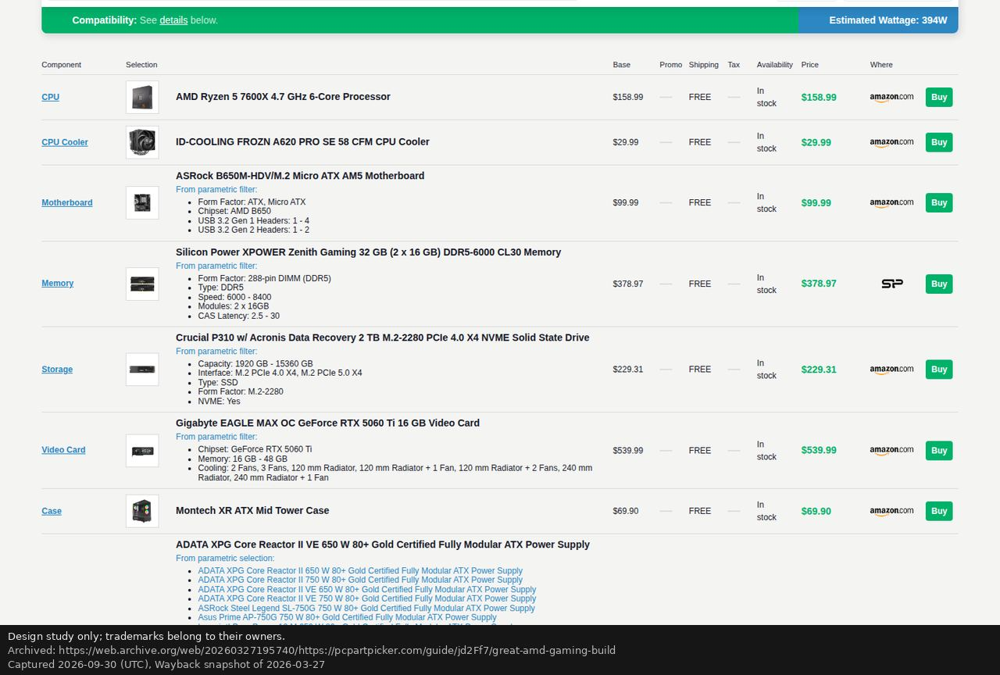
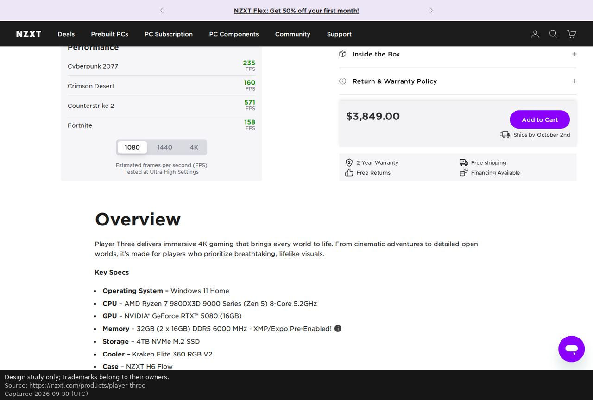
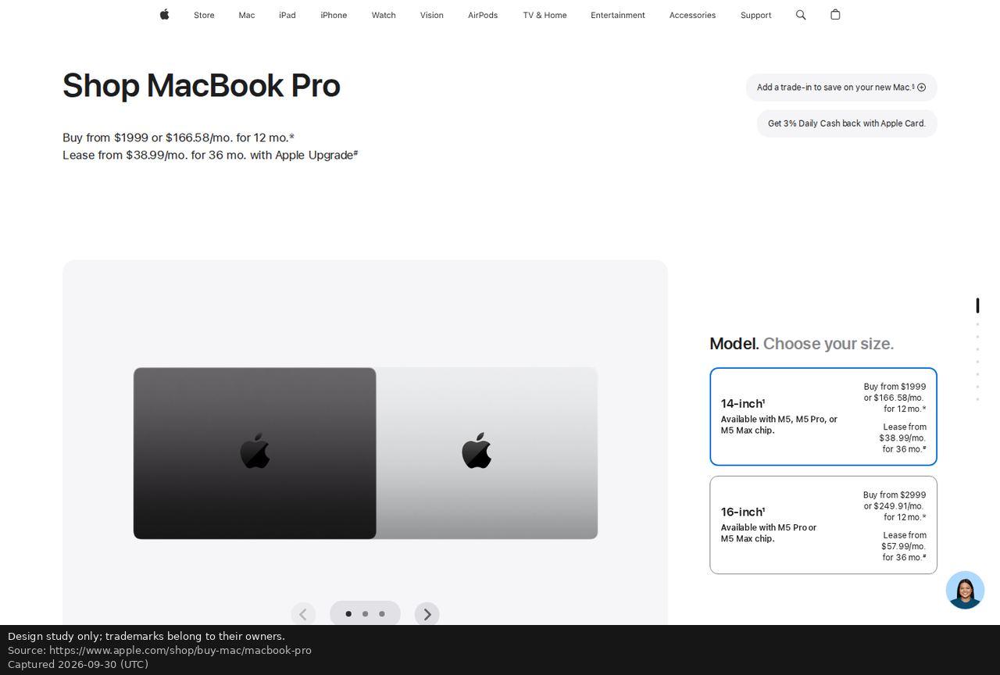
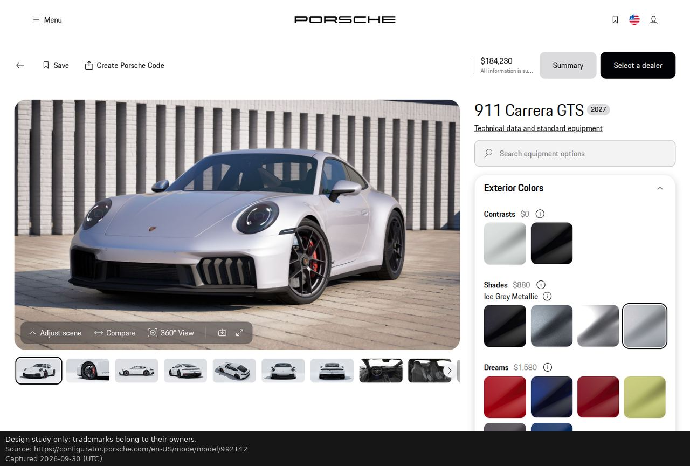
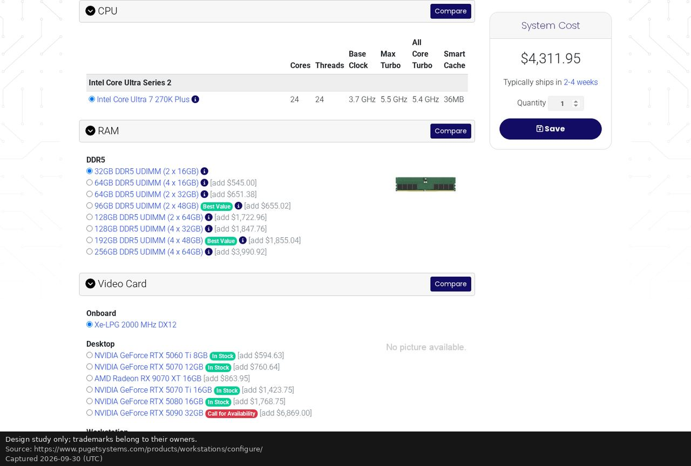
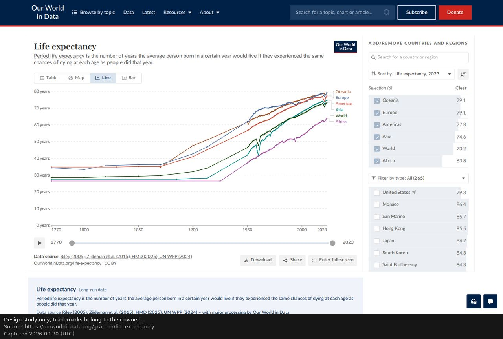
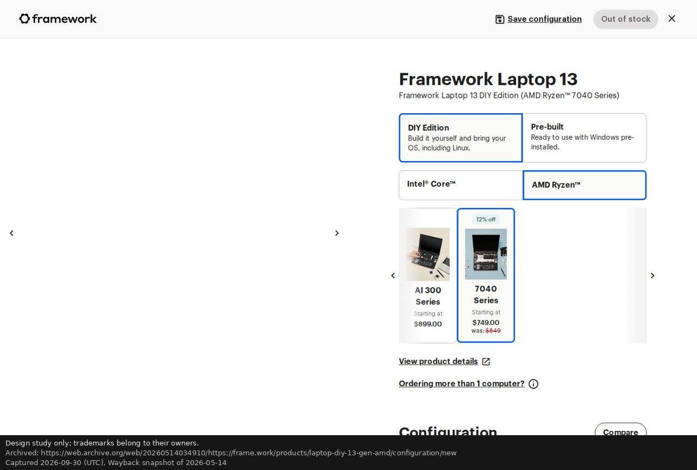

# Reference study (WP-DS0)

Owner: design-lead · Captured 2026-09-30 · Status: for review

**Design study only; trademarks belong to their owners.** These notes study interaction patterns.
Rig Lab copies no logos, text, imagery or other assets (CLAUDE.md rule 9). The screenshots and
their captions (URL, capture date, archive snapshot) are in [`references/`](references/README.md).

## How the study was done

- Headless Chromium through a Playwright script: one browser, one request at a time per host.
- Every site was captured at 1440 × 900 and 390 × 844, plus one key interaction where it could be
  reached without an account. No login, no form submission, no cart action.
- Non-essential cookies were declined where a clear button existed. One marketing modal (NZXT) was
  closed with its own close button.
- PCPartPicker and Tesla block headless browsers here, and frame.work timed out (HTTP 408). Those
  were studied through Wayback Machine snapshots; each caption names the snapshot date.

## What each reference teaches

### PCPartPicker (Wayback snapshots)

**Learn**
- **One status for the whole build, always visible:** a full-width bar reads "Compatibility: See
  details below" next to "Estimated Wattage: 394W". Compatibility is a sentence, not an icon.
- **Every price is broken down:** Base, Promo, Shipping, Tax, Availability, Price and Where.
- The category page keeps a **part-list summary** (parts, total, wattage) beside the table.
  **Compatibility filtering is on by default.**
- **Compare is built into the table:** row checkboxes, then "Compare Selected".
- **At 390 px each row becomes a stacked card** with a two-column spec grid, and Filters and
  Sort become two buttons ([pcpp-gpu-390](references/pcpp-gpu-390.jpg)).

**Avoid**
- Saturated green and blue bars that shout even when nothing is wrong.
- Prices in the same green as "compatible". Colour then means two things at once.
- Tiny grey spec text, and no hierarchy between what matters and everything else.
- A cookie bar that covers the table.

**Used in:**
- all three directions: the build-level status, the per-price breakdown, and stacked rows on phone;
- Bench: the summary kept beside the table.

### NZXT: Player Three configurator (live)

**Learn**
- Configuration is a short vertical stack of segmented choices (Series, Model, Colour). Each is
  labelled with its current value ("Color: Black").
- A sticky price with the primary action.
- A 1080 / 1440 / 4K toggle beside the game numbers.

**Avoid (the most important lesson in the set)**
- **Single-number FPS** ("Cyberpunk 2077 235 FPS"). The only context is "Tested at Ultra High
  Settings". There is no range, no confidence, no source, and no word on whether upscaling or
  frame generation is included.
- Green numbers as praise.
- An email-capture modal on arrival.
- A saturated purple brand colour used for every selected state.

**Used in:** the FPS rules for every direction. It is always a range, with a confidence level,
the test conditions, "native, no frame generation" stated, and a link to the method.

### Apple: MacBook Pro configurator (live)

**Learn**
- **One decision in focus.** The heading is a bold noun plus a grey instruction ("Model. Choose
  your size.").
- Large selectable cards that carry their own price range.
- Selection is a blue outline, not a fill.
- **A slim progress rail at the right edge** advances as you choose.
- Superscript markers attach terms to prices without clutter.

**Avoid**
- Whitespace that could never hold a 40-row catalogue.
- Financing lines that compete with the price.

**Used in:**
- Folio: its footnote markers;
- Studio: its step track;
- all three: the one-decision headline.

### Porsche: 911 configurator (live)

**Learn**
- **The product render dominates, and it updates in place on every choice.** Picking Ice Grey
  Metallic moved the header price from $183,350 to $184,230 in the same moment.
- **Prices sit at the option-group level** ("Shades $880"), not on every swatch.
- A disclaimer rides with the total ("All information is subject to change").
- A quiet toolbar sits over the render: Adjust scene, Compare, 360° View.
- **On phone the render goes on top and the price docks at the bottom** with the primary action
  ([porsche-390](references/porsche-390.jpg)).

**Avoid**
- A consent modal that blocks the product.
- Heavy swatch tiles for options that aren't visual.

**Used in:**
- Studio: the whole structure;
- Bench and Folio: the docked total on phone;
- all three: group-level prices.

### Puget Systems: workstation configurator (live)

**Learn**
- **Alternatives are priced as deltas from your current pick** ("[add $545.00]"). That is the
  right way to price a change.
- Spec columns for CPUs: cores, threads, base, turbo, cache.
- Stock and value badges.
- A sticky "System Cost" with the ship time.

**Avoid**
- Bracketed grey deltas.
- Every category expanded on one enormous page.

**Used in:**
- all three: price-delta hints ("for SAR 350 less" in Folio's verdicts);
- Bench: its spec columns.

### Our World in Data: chart page (live)

**Learn**
- **The source is part of the figure.** One line under the chart reads "Data source: …" with the
  licence.
- Values are listed beside the chart with the sort key named ("Sort by: Life expectancy, 2023").
- Table, Map, Line and Bar tabs.

**Avoid:** nothing significant. This is the model for provenance without clutter.

**Used in:**
- Bench: the status-line provenance;
- Folio: numbered margin notes;
- Studio: "Prices as of … Sources" in the dock.

### Framework: DIY laptop configurator (Wayback snapshot)

**Learn**
- Segmented choice rows with two-line descriptions (DIY or Pre-built, Intel or AMD).
- Stock state in the header ("Out of stock").
- "Save configuration" as a first-class action.
- Compare inside the configuration.
- "Starting at" pricing with the previous price struck out.

**Avoid**
- A carousel for the series choice.
- Heavy blue outlines everywhere.

**Used in:**
- all three: draft saving ("Draft, saved 17:42"), and compare built into the list.

### Linear, Vercel, Stripe, Raycast (live)
| | Learn | Avoid |
|---|---|---|
| [Linear](references/linear-1440.jpg) | Typographic restraint: a large tight headline with a muted secondary line; product UI as the image; crisp small icons; quick, quiet motion | Copying the dark-SaaS look wholesale (near-black plus one accent) |
| [Vercel](references/vercel-1440.jpg) | A strict grid, generous space, one mark, monochrome confidence | The logo wall |
| [Stripe](references/stripe-1440.jpg) | A live-ticking number in tabular figures ("1.72440179%"); a headline that mixes weights | **The gradient ribbon** (rejected on sight), and CTA overload |
| [Raycast](references/raycast-1440.jpg) | Keyboard-first thinking; small crisp type in dark UI | A centred hero with abstract glowing art |

**Used in:**
- Bench: keyboard hints ("J K move, Space compare, Enter select");
- all three: tabular live numbers, the restraint, and one bold element per screen.

## Sites not studied

| Site | Why | What we did instead |
|---|---|---|
| Tesla design studio (tesla.com) | Blocked here. Two Wayback snapshots (2026-06-07 and 2026-03-06) render an empty page (0 characters of text after 15 s), because the app's scripts were not archived. The 2026-07-06 capture is a 4.5 KB stub. | Porsche covers the "live product that reacts instantly" lesson |
| Polestar configurator (polestar.com) | Reachable, but an empty page in headless Chromium after 20 s (0 characters of text). Not pursued further, to avoid anything that looks like working around bot protection. | Porsche, as above |
| PCPartPicker, live | Blocked by the site's bot protection. One accidental live request came from a link resolved outside the archive; it got the block page, and all later requests stayed in the archive. The archived CPU table's rows were loaded by a script the archive didn't keep, and the archived video-card page served case rows. | Wayback part list, guide, and category tables; the table pattern is what matters |
| NZXT BLD custom builder | No longer offered on nzxt.com (the site has prebuilt Player PCs, Flex rental and a DIY parts shop) | The Player Three prebuilt configurator |
| frame.work, live | HTTP 408 to headless Chromium | Wayback snapshot of 2026-05-14 |

**Tesla: not studied, waived in writing by the Director on 2026-10-01** (QA finding DS0-11). The
two Wayback snapshots tried on 2026-09-30 both render an empty page, and Porsche covers the
car-configurator lesson:
- https://web.archive.org/web/20260306214633if_/https://www.tesla.com/model3/design (snapshot of
  2026-03-06)
- https://web.archive.org/web/20260607114516if_/https://www.tesla.com/model3/design (snapshot of
  2026-06-07)

## Patterns every direction must keep

These come straight from the study:
1. **FPS is always a range, with a confidence level, conditions and "native" stated.** NZXT shows
   exactly what not to do.
2. **A build-level status sentence**, plus per-row reasons (PCPartPicker).
3. **Instant in-place update on every choice**, with the price moving in the same moment (Porsche).
4. **Provenance travels with the figure** (Our World in Data), not in a footer.
5. **Alternatives priced as deltas** from the current pick (Puget).
6. **One decision in focus** (Apple). **A docked total on phone** (Porsche, NZXT).
